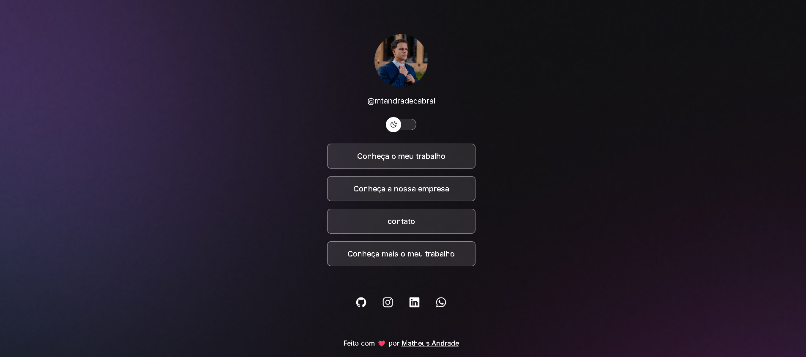

# 🌳 Meus Links (Link in Bio)

  

## 💻 Sobre o projeto

Este é um projeto de agregador de links (estilo Linktree), desenvolvido para ser uma página de apresentação pessoal e profissional. Ele reúne em um único lugar todos os links importantes, como portfólio, redes sociais e formas de contato.

O projeto foi construído com foco na experiência do usuário, incluindo uma funcionalidade de alternância de temas (Light/Dark Mode).

## ✨ Funcionalidades

- 🔗 **Botões de redirecionamento:** Links diretos para portfólio, empresa e contatos.
- 🌓 **Theme Switcher:** Alternância suave entre o modo claro (Light) e o modo escuro (Dark).
- 📱 **Design Responsivo:** Layout adaptável para dispositivos móveis e desktops.
- 🌐 **Redes Sociais:** Ícones com links diretos para GitHub, Instagram, LinkedIn e WhatsApp.

## 🚀 Tecnologias Utilizadas

Este projeto foi desenvolvido utilizando as seguintes tecnologias:

- **HTML5:** Estruturação semântica da página.
- **CSS3:** Estilização, variáveis de cores, animações e responsividade.
- **JavaScript:** Lógica para a troca de temas (Light/Dark mode).

## 📝 Autor

Feito com ❤️ por **Matheus Andrade**

- GitHub: [@mtandradecabral](https://github.com/mtandradecabral)
